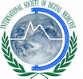
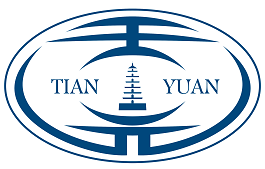
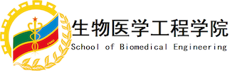

The International Symposium on Image Computing and Digital Medicine 2019 (**ISICDM 2019**) will be held on Aug. 24-26, 2019 at Xi'an, China, along with a summer school on Aug. 22-23, 27-28, 2019.

## Introduction

The Third International Symposium on Image Computing and Digital Medicine (**ISICDM 2019**) will be held on Aug. 24-26, 2019 at Xi'an, China. **ISICDM 2019** is jointly sponsored by the International Society of Digital Medicine and Tianyuan Mathematical Center in Northwest China, and jointly hosted by Xidian University and Fourth Military Medical University. **ISICDM 2019** aims to bring together active researchers in medicine, engineering, computer science, data analysis and mathematics to communicate on issues with common study interests, which builds the bridge for mutual understandings between clinicians, engineers, scientists and mathematicians.

The main topics of **ISICDM 2019** will include (but not limited to):

**Image computing techniques:** Image processing, image segmentation, image registration, image reconstruction, image matching, feature extraction, image detection and recognition, shape analysis, machine learning, deep learning, computing hardware (FPGA, DSP, IC) for image processing and machine learning;

**Digital medicine:** Medical image analysis, MR image reconstruction, CT image reconstruction, radiomics, molecular imaging, big-data analysis in medicine, 3D visualization, intelligent target delineation of radiotherapy, digital pathology, bioinformatics, computational anatomy, machine/deep learning in medicine.

**ISICDM 2019** will include keynote speeches, invited talks, oral presentations, posters, tutorials, panel discussions. Multiple special sessions will be organized for the following topics: advances in medical image analysis, advances in image reconstruction, problems and challenges in clinical medical imaging, machine learning and image processing, deep learning in medical imaging, mathematical methods in medical imaging, image segmentation and 3D visualization, interdisciplinary communication.

## General Chairs

* **Prof. James Duncan**,  Yale University, USA
* **Prof. Shiyuan Liu**,   Second Military Medical University, China
* **Prof. Terry Peters**,  Western University, Canada

## Program Chairs

* **Prof. Jing Yuan**,     Xidian University, China
* **Prof. Hongbing Lu**,   Fourth Military Medical University, China
* **Prof. Dazhe Zhao**,    Northeastern University, China

## Scientific Committee

* **Prof. Nicholas Ayache**,  French Institute of Comp. Sci. and App. Math., France
* **Prof. Dexing Kong**,      Zhejiang University, China
* **Prof. Chunming Li**,      University of Electronic Science and Technology of China, China
* **Prof. Shaohua Zhou**,     Chinese Academy of Sciences, China
 
## Invited Plenary Speakers

* **Prof. Zongben Xu**,     Xi’an Jiaotong University, China
* **Prof. Aaron Fenster**,  Robarts Research Institute, Canada
* **Prof. Terry Peters**,   Western University, Canada
* **Prof. Xinfeng Liu**,    Jinling Hospital, Nanjing University, China
* **Prof. Dinggang Shen**,  University of North Carolina at Chapel Hill, USA
* **Prof. Xuecheng Tai**,   Bergen University, Norway
* **Dr. Le Lu**,            Ping An Technology US Research Labs, USA
* **Prof. Shaohua Zhou**,   Chinese Academy of Sciences, China
* **Prof. Haiping Ren**,    National Institutes for Food and Drug Control, China
* **Prof. Xiaochuan Pan**,  University of Chicago, USA
* **Prof. Yike Guo**,       Imperial College London, UK
* **Prof. Zhengrong Liang**, State University of New York at Stony Brook, USA
* **Prof. Hanchuan Peng**,  Allen Institute for Brain Science, USA
* **Prof. Ke Chen**,        University of Liverpool, UK
* **Prof. Laurent D. Cohen**, University Paris Dauphine, France
* **Prof. Kaichun Wu**,     First Affiliated Hospital of Air Force Medical University, China
* **Prof. Kun Huang**,      Indiana University, USA

## Website

Please follow this [link](http://www.imagecomputing.org/2019/index.html) to find more details of **ISICDM 2019**, its associate summer school, challenges and programs.

## Sponsors

{:height="200px"}. {:height="200px"}. {:height="200px"}. {:height="200px"}.
