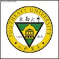
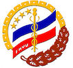
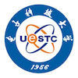
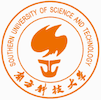

International Forum on Frontiers of Intelligent Medical Image Analysis and Computing 2021 will be organized online by **Xidian University, Southeastern University and Hong Kong Baptist University**. The Forum is supported by the Ministry of Science and Technology (Grant no. 20200027095).

## Introduction

The studies of intelligent medical image analysis and computing becomes an interdisciplinary science of modern medical image computing, artificial intelligence and big-data analysis etc., and an emerging frontier subject integrating the art of mathematical and theoretical research, engineering development and medicine study by 
an organic unity of different technical resources. With rapid developments of artificial intelligence and data analysis during recent years, AI and its related technologies have been successfully applied into all aspects of medical image analysis and computing, which largely improve the accuracy of clinical diagnosis and treatment by modern medical image-assisted diagnosis and surgery. At the same time, new medical imaging methods result in vast volume of data and motivate necessities of medical big-data analysis, which leads to new challenges in AI, big-data analysis and high-performance optimization computing, and encourages innovations and breakthroughs in both theory and technology. **The Intelligent Medical Image Analysis and Computing Frontier Forum 2021 is funded by the Ministry of Science and Technology (Grant no. 20200027095), and organized jointly by Xidian University / Frontier Research Institute of Xidian University, Southeast University, Hong Kong Baptist University and other collaborated universities**. The forum includes a series of online talks, lectures and short courses presented by the invited speakers.

## Invited Speakers

* **Prof. Aaron Fenster**, Western University, Canada, Fellow of IEEE/IOP/AAPM/SPIE/Canadian Academy of Health Sciences
* **Prof. Fabio Roli**, University of Cagliari, Italy, IEEE/IAPR Fellow
* **Prof. Marcello Pelillo**, University of Venice, Italy, IEEE/IAPR Fellow
* **Prof. Terry Peters**, Western University, Canada, Fellow of IEEE/IOP/AAPM/SPIE/CAHS/Royal Society of Canada 
* **Prof. Xuecheng Tai**, Hong Kong Baptist University, China, SIAM Fellow
* **Prof. Sebastien Ourselin**, Kings College London, UK, MICCAI Fellow, Director of BME School at KCL
* **Prof. Zhengrong Liang**, State University of New York, IEEE Fellow 
* **Prof. Michael Hintermueller**, Weierstrass Institute, Germany, SIAM Fellow, Director of Weierstrass Institute
* **Prof. Ismail Ben Ayed**, ETS Montreal, Canada, Chair Professor of Medical Imaging and AI

## Organization and Academic Committee

* **Prof. Jing Yuan**, Xidian University, China
* **Prof. Jijun Liu**, Southeastern University, China
* **Prof. Xuecheng Tai**, Hong Kong Baptist University, China
* **Prof. Hongbing Lu**, Air Force Medical University, China
* **Prof. Chunming Li**, University of Electronic Science and Technology of China, China
* **Prof. Shuiping Gou**, Xidian University, China
* **Prof. Dexing Kong**, Zhejiang University, China
* **Prof. Xiaoping Yang**, Nanjing University, China
* **Prof. Jian Sun**, Xi'an Jiaotong University, China
* **Prof. Chunlin Wu**, Nankai University, China
* **Prof. Xiaoying Tang**, Southern University of Science and Technology, China
* **Prof. Shanshan Wang**, Shenzhen Institute of Advanced Research, Chinese Academy of Sciences, China

## Schedules and Contacts

Schedules (all recorded videos will be uploaded on related websites):

* **Prof. Michael Hintermueller** 
  - Semi-smooth Newton methods: theory, numerical algorithms and applications (I): 15:30-16:30(Beijing time), July 19, 2021
  - Semi-smooth Newton methods: theory, numerical algorithms and applications (II): 15:30-16:30(Beijing time), July 26, 2021
  - Graduate course (autumn semester 2021): Advanced Topics in Optimization (32 class hours), start in October 2021

* **Prof. Marcello Peilillo**
  - Graduate course (autumn semester 2021): Advanced Mathematical Theories and Methods with Applications to Machine Learning (32 class hours), start at the end of September 2021
  - Recent Advances in Graph-Theoretic Clustering: Theory, Algorithms, Applications (I): 14:30 -15:30 (Beijing time), September 15, 2021
  - Recent Advances in Graph-Theoretic Clustering: Theory, Algorithms, Applications (II): 14:30 -15:30 (Beijing time), September 22, 2021
  - Recent Advances in Graph-Theoretic Clustering: Theory, Algorithms, Applications (III: 14:30 -15:30 (Beijing time), September 27, 2021

* **Prof. Fabio Roli**
  - Graduate course (autumn semester 2021): Statistical Learning and Adversarial Machine Learning: Fundamentals and Advanced Concepts (32 class hours), start in September 2021

* **Prof. Ismail Ben Ayed** 
  - Learning from limited supervision: 15:30-16:30(Beijing time), August 3, 2021
  - Conditional Random Field Losses for Weakly Supervised Segmentation: Beyond Gradient Descent: 15:30-16:30(Beijing time), August 6, 2021
  - Constrained Deep Networks: 15:30-16:30(Beijing time), August 9, 2021

* **Prof. Aaron Fenster** 
  - 3D Ultrasound Imaging (I): 20:00-21:00(Beijing time), August 23, 2021
  - 3D Ultrasound Imaging (II): 20:00-21:00(Beijing time), September 7, 2021
  - 3D Ultrasound Imaging (III): 20:00-21:00(Beijing time), September 21, 2021

* **Prof. Ming-Jun Lai** 
  - Multivariate Splines for Medical Data Analysis: 20:00-21:00(Beijing time), September 9, 2021

**Please be free to contact Prof. Jing Yuan at cn.yuanjing (AT) yahoo (DOT) com, for more information**.

---

               
